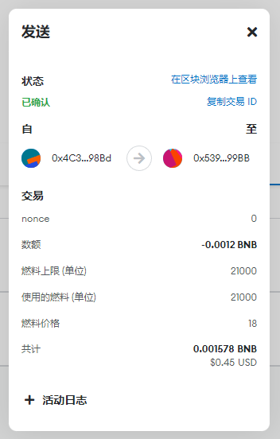
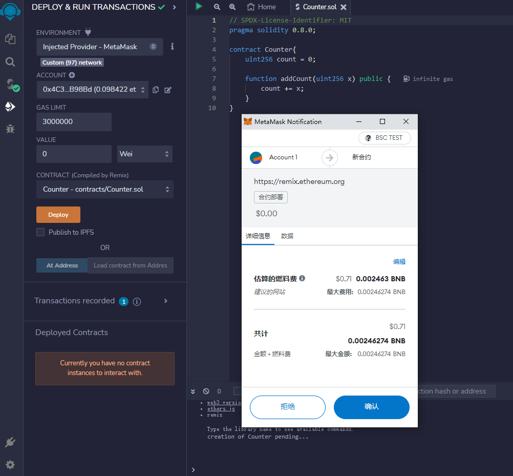
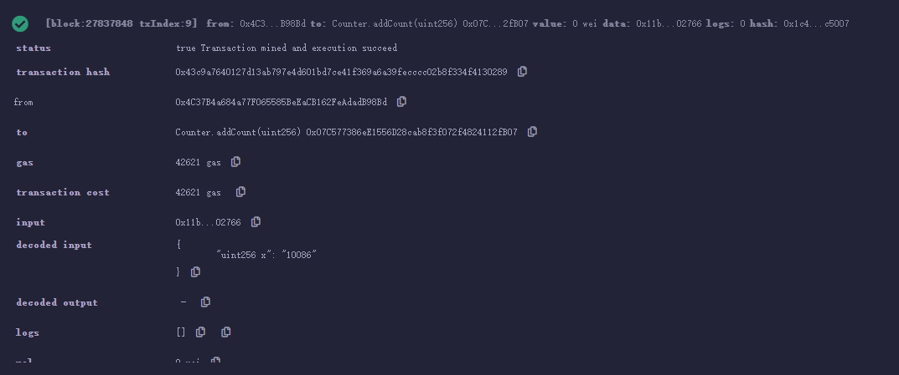
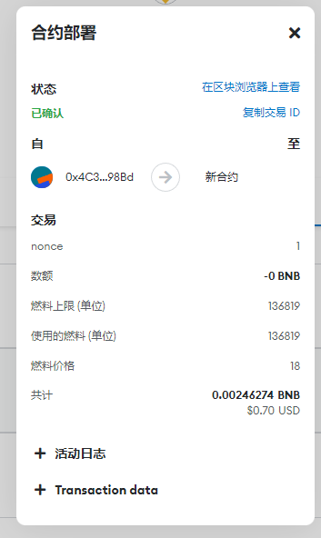
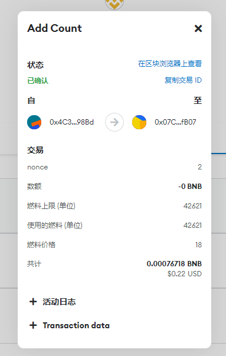

## 作业一：执行一次转账
#### 交易hash：0xb9a73db7aa9eae1b130f5343e76caaeeca2e448f8ae79a58ca367af2c3e68eda
#### 交易url：[https://testnet.bscscan.com/tx/0xb9a73db7aa9eae1b130f5343e76caaeeca2e448f8ae79a58ca367af2c3e68eda](https://testnet.bscscan.com/tx/0xb9a73db7aa9eae1b130f5343e76caaeeca2e448f8ae79a58ca367af2c3e68eda)


## 作业二：创建一个Counter合约并部署

#### 合约代码：
```Solidity
// SPDX-License-Identifier: MIT
pragma solidity 0.8.0;

contract Counter{
    uint256 count = 0;

    function addCount(uint256 x) public {
        count += x;
    }
}
```
#### 部署到BSC测试网

#### 调用addCount()函数
.png "add")
#### 查看结果

#### 在区块链浏览器上查看交易信息



### 结果验证：
#### 合约地址：0x07C577386eE1556D28cab8f3f072f4824112fB07
#### 点击查看：[https://testnet.bscscan.com/address/0x07c577386ee1556d28cab8f3f072f4824112fb07](https://testnet.bscscan.com/address/0x07c577386ee1556d28cab8f3f072f4824112fb07)
#### 调用add()所对应的交易hash：0x43c9a7640127d13ab797e4d601bd7ce41f369a6a39fecccc02b8f334f4130289
#### 点击查看：[https://testnet.bscscan.com/tx/0x43c9a7640127d13ab797e4d601bd7ce41f369a6a39fecccc02b8f334f4130289](https://testnet.bscscan.com/tx/0x43c9a7640127d13ab797e4d601bd7ce41f369a6a39fecccc02b8f334f4130289)
