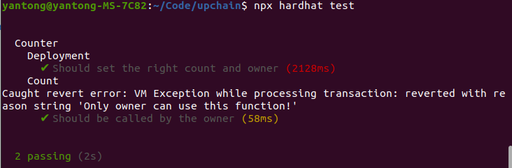

### 合约地址
[https://goerli.etherscan.io/address/0x0871AC0adC054958f72CB6974934839979B61D20](https://goerli.etherscan.io/address/0x0871AC0adC054958f72CB6974934839979B61D20)

### 使用Hardhat测试Counter
##### Case1 部署者成功调用count()
##### Case2 其他地址调用失败，这里用异常处理来判断
```JavaScript
            // 使用断言检查owner调用是否抛出异常
            expect(await lock.connect(owner).addCount(1)).to.be.reverted;
            // 检查count的值是否被修改为1
            expect(await lock.getCount()).to.equal(1);
            // 使用断言检查其他地址调用是否抛出异常
            try {
                await lock.connect(otherAccount).addCount(2);
            } catch (error) {
                console.log("Caught revert error:", error.message);
            }
```
##### 测试结果



