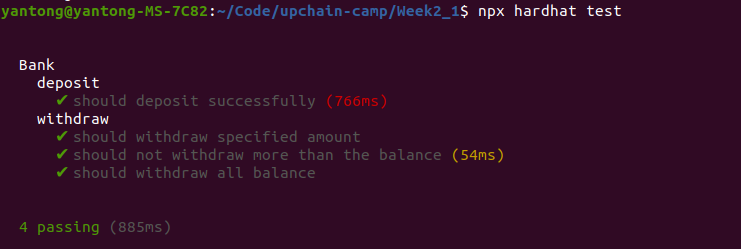
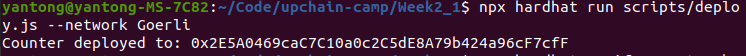
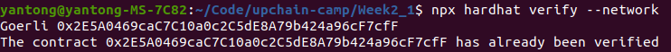
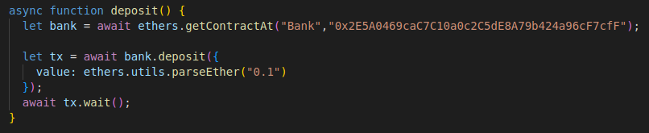
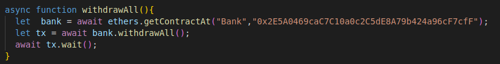

# 编写一个bank合约

## 合约地址
[0x2E5A0469caC7C10a0c2C5dE8A79b424a96cF7cfF](https://goerli.etherscan.io/address/0x2E5A0469caC7C10a0c2C5dE8A79b424a96cF7cfF)

## 合约内容
[Bank.sol](./contracts/Bank.sol)

## 合约测试
测试脚本：[Bank.js](./test/Bank.js)

测试结果：

## 合约部署

## 合约验证

## 调用deposit()函数向合约转账

## 调用withdrawAll()函数取款

## 在区块链浏览器上查看结果

