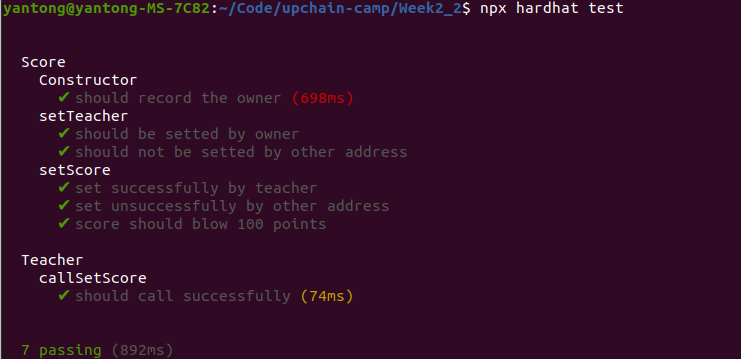
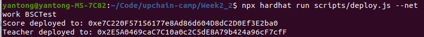
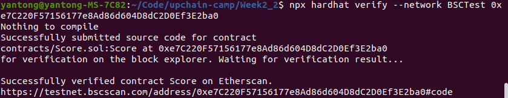
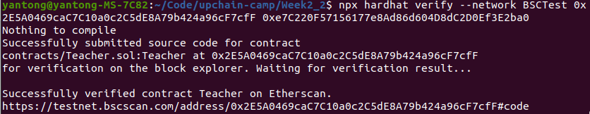
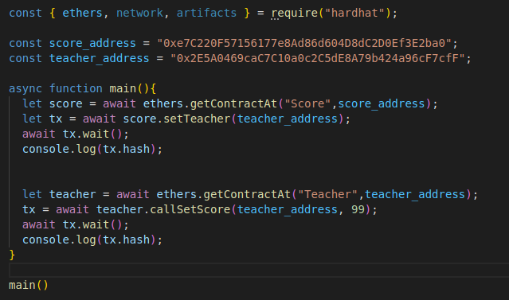
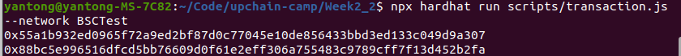
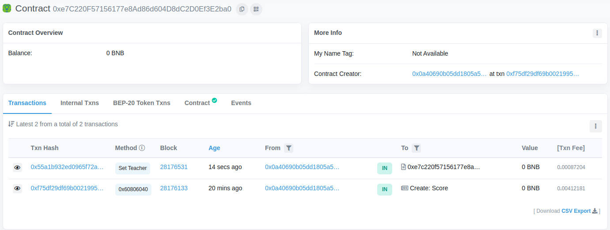
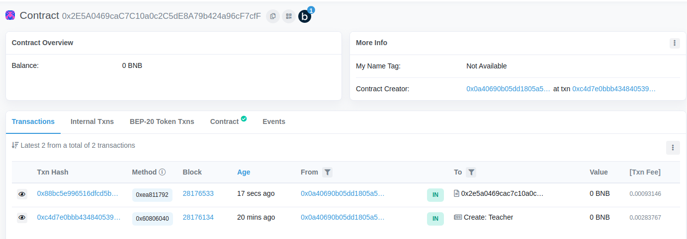

# 编写Score、Teacher合约

## 合约地址
Score:[0xe7C220F57156177e8Ad86d604D8dC2D0Ef3E2ba0](https://testnet.bscscan.com/address/0xe7C220F57156177e8Ad86d604D8dC2D0Ef3E2ba0)
Teacher:[0x2E5A0469caC7C10a0c2C5dE8A79b424a96cF7cfF](https://testnet.bscscan.com/address/0x2E5A0469caC7C10a0c2C5dE8A79b424a96cF7cfF)

## 合约内容
[Score.sol](./contracts/Score.sol)
[Teacher.sol](./contracts/Teacher.sol)

## 合约测试
Score测试脚本：[Score.js](./test/Score.js)
Teacher测试脚本：[Teacher.js](./test/Teacher.js)

测试结果：

## 合约部署

## 合约验证

## 调用callSetScore()修改学生成绩

## 在区块链浏览器上查看结果

